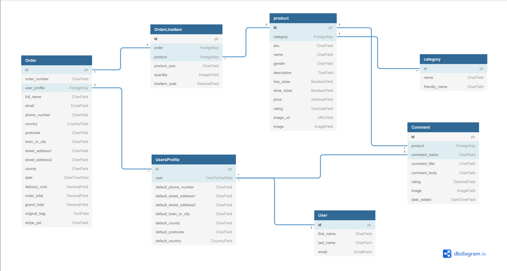

<h1 align="center">Foot Connect</h1>

This is the fourth and final milestone (Full Stack Frameworks with Django) project as a Full Stack Software Developer student with code institute.

Foot Connect is a well-established online athletic footwear and apparel retailer. Our aim is to bring you the hottest fashion on the market. The site is designed to be responsive and accessible on multiple devices, making it easy to navigate for new and existing visitors.

[visit website here](https://foot-connect.herokuapp.com/)


# User Experience (UX)

| User Story   | As a...   | I want to be able to... | So that i can.|
| ---------    | -------  |   ------------         | ------------- |
|              |          | <h4 align="center">**Viewing and Navigation** </h4> |               |
|              | Shopper  | Understand the main purpose <br> of the site. | Decide if i want to stay. | 
|              | Shopper  | View individual product details| Identify the price, description, <br> product rating, product image, available <br> sizes and read product reviews |
|              | Shopper  | Quickly identify deals, clearance <br> items and special offers. | Take advantage of special savings <br> on products I'd like to purchase.     
|              | Shopper  | Easily view the total of <br> my purchases at any time. | Avoid spending too much. |
|              |          | <h4 align="left">**Registration and User Accounts** </h4>     |                 |      
|              | Site User  | Easily register for an account | Have a personal account and view my profile. |
|           | Site User | Login or Logout of my account |  Access my personal account information <br> and any previous order history | 
|         | Site User | Easily recover my password <br> in case i forget it. | Recover access to my account. |
|          | Site User | Receive an email confirmation <br> after registering. | Verify my account registration <br> was successful |
|          | Site User | Have a personalized user profile | View my order confirmation, <br> history, wish list, reviews and  <br> view/update personal delivery details |
|          |          | <h4 align="center"> **Sorting and searching** </h4> |          | 
|          | Shopper    | Sort the list of available products | Easily identify products by category, <br> name, rating, and price |
|          | Shopper | Sort a specific category | Find the best-priced or best-rated product <br> or price within a category |
|          | Shopper | Add a product to my wish list | Quickly find a product I've saved, <br> or purchase again |
|          | Shopper | Search for a product by <br> name or description | Find a specific product I'd like to purchase. |
|          | Shopper | Easily see what I've searched <br> for and the results |Decide if the product I'm after is available |
|         |          | <h4 align="center"> **View and Leave Reviews**</h4> |       |
|    | Site User | Read all reviews  | Decide if i want to purchase the product <br> based on good or bad reviews |
|        | Site User | Add a review | Share my thoughts about a product in <br> order to help other shoppers decide. |
|         | Site User | Delete a review  | Remove reviews when needed. |
|         |          | <h4 align="center"> **Purchasing and Checkout**</h4> |       |
|         | Shopper | Easily select the size and quantity <br> of a product when purchasing it. | Can be assured I'm selecting <br> size and quantity I want |
|         | Shopper | View items in my cart to <br> be purchased | Identify the total cost of the <br> items i want to purchase |
|         | Shopper | Change the quantity of items in my cart | Easily make changes before checking out | 
|          | Shopper | see my order confirmation <br> upon checkout | Verify my order |
|        | Shopper | Receive an email confirmation <br> upon checkout | I have a personal record of my order |
|         |           | <h4 align="center"> **Admin User Account**</h4>  |       |
|         | Admin User | Add a product | Add new items to my store |
|         |              | Edit/update a product | Change product prices, descriptions, <br> images and other related fields |
|         |              | Delete a product | Remove items no longer on <br> offer or out of stock |
 

# Design Choices

## Colour Scheme


## Variables

- Bootstrap variables were chosen to keep the colour scheme of the site clean and consistent.

| variable | Hex |
| -------- | --- |
| --bs-yellow | #ffc107 |
| --bs-gray-700 | #495057 |
| --bs-info | #0dcaf0 |
| --bs-body-color | #0c0e0f |
| --bs-body-bg | #fff |
  

## Typography

-  ### [Google Fonts](https://fonts.google.com/)

- ### 'Archivo Black' font has been selected to represent the sites logo.
- ### 'Archivo Black' has been used for sites title.
- ### 'Helvetica' has been chosen as the sites default font 

## Imagery

### Hero Image [view here](media/new-footconnect-hero.png)
- For the website Imagery is very important. On entering the website shoppers are presented with a large hero image that is designed to capture the shopper's attention. The banner is made up of four section each displaying product categories,
to the left of the banner is the sites logo. When a shopper clicks on the banner, they will be redirect to the all products page.

-  ### All product images on the site were sourced from 

-  ### [Laced](https://www.laced.co.uk/)
-  ### [kaggle](https://www.kaggle.com/)
-  ### [pexels](https://www.pexels.com/)
-  ### [unsplash](https://unsplash.com/)

# Features

## Current

### Home Page - [view here](media/footconnect-home-page.png)

- A background hero image can be seen.
- website categories. 
- Filtered footwear product cards when click will direct shoppers to the specific products brand page.
- Product image carousel when clicked will direct shoppers to the products detail page.
- A call-to-action 'Shop Now' button underneath product cards.
- A scroll up button will display as users scroll down for easy access back to the top page.
- Delivery offer can be seen at the bottom of home page.
- app store banner can be seen at the bottom of every page.
- Website footer can be seen displayed on every page

### Navigation - [view here](media/footconnect-navbar.png)

- As users entering the website, they are greeted with a clean and easy to read navigation bar which contains menu links and a search bar for quick and easy access to products.

### Search 

- All can search the site using a search query to identify products by category or specific product details.

### User Profile - [view here](media/profile-page.png)

- A users delivery information and order history are saved to their profile.
- A user can view their order history.
- A user can update their delivery information.


### Registration

- Users can register their details by providing an email address, username, and password to create an account.


### Sign In - [view here](media/sign-in.png)

- Users can log in to access their profile page, order history, and make any changes to their delivery information.


### Products
    
- Every user has complete access to view and purchase products

| Men | Women | Kids | Accessories | Special Offers |
| --- | ----- | ---- | ----------- | -------------- |
| Sportswear | Sportswear | Sportswear | Hat & Caps | New Arrivals |
| Jeans | Jeans | Jeans | Bags & Wallets | Deals |
| Shoes | Shoes | Shoes | All Accessories | Clearance  |
| Hoodies | Hoodies | Hoodies |        | All Specials  |
| Tracksuits | Tracksuits | Tracksuits |     |         |
| Sweatshirt | Sweatshirt | Sweatshirt |     |         |    
| T-Shirts   | T-Shirts   | T-Shirts   |     |         |    
| All Clothing | Dresses  | All Clothing  |     |      | 
|      |  All Clothing |     |      |      |

 
### Product Details Page 

### users can:

- Click an image which will direct them to the products detail page. Here users will find more product information, sizes, and the quantity they can purchase. 

### Shopping Bag

### Users can:

- View any products they have added to their shopping bag.
- Have the option to update or remove an item.

### Checkout

### Users can:

- Enter in a name and delivery address. 
- Registered users (if logged in, can save their delivery details for easy access)
- Update their profile with the new delivery information (if they registered and logged in)
- Checkout and pay securely via the Stripe Payment system
- Input new delivery information if necessary or because they are checking out as a guest
- Users are sent out order confirmation emails

### Reviews

- Shoppers can view all reviews
- Registered users can add or delete reviews when logged in.


### Contact us [view](/media/contact.png)

- Shoppers can contact the store with any question or issues they may have

### Custom form validation [view](/media/custom.png)

- The contact us form has custom validation 

### Footer 

- The footer can be seen on all pages and provides users additional link options.

# Future Features

- Allow users to register with their social media accounts

# Database Design 

- ### The database schema 



# Wireframes

### Desktop view

- [Home](https://balsamiq.cloud/seqremb/pvddy51/r2278)
- [Product Page](https://balsamiq.cloud/seqremb/pvddy51/r7F40)
- [Sign In](https://balsamiq.cloud/seqremb/pvddy51/r73F5)
- [Registration](https://balsamiq.cloud/seqremb/pvddy51/r5D8B)
- [Product Description](https://balsamiq.cloud/seqremb/pvddy51/r7B0C)
- [Profile](https://balsamiq.cloud/seqremb/pvddy51/rC400)
- [Shopping Bag](https://balsamiq.cloud/seqremb/pvddy51/rBCCD)
- [Checkout](https://balsamiq.cloud/seqremb/pvddy51/r64C9)

### Mobile view

- [Home](https://balsamiq.cloud/seqremb/pvddy51/rA2D1)
- [Product Page](https://balsamiq.cloud/seqremb/pvddy51/rE2B2)
- [Sign In](https://balsamiq.cloud/seqremb/pvddy51/rBD6F)
- [Registration](https://balsamiq.cloud/seqremb/pvddy51/r6990)

### Tablet view

- [Home](https://balsamiq.cloud/seqremb/pvddy51/rD80B)
- [Product Page](https://balsamiq.cloud/seqremb/pvddy51/r91E1)
- [Sign In](https://balsamiq.cloud/seqremb/pvddy51/r0CB3)
- [Registration](https://balsamiq.cloud/seqremb/pvddy51/r11F0)


# Technologies Used

### Languages
    

-  ### [HTML5](https://en.wikipedia.org/wiki/HTML5)
    - Used for the website's markup language.
-  ### [CSS3](https://en.wikipedia.org/wiki/CSS)
    - Used to style the website.
-  ### [JavaScript](https://en.wikipedia.org/wiki/JavaScript)
    - Used to make the web pages more interactive.
-  ### [Python](https://en.wikipedia.org/wiki/Python)
    - Used for the website's backend

### Frameworks
    
-  ### [Bootstrap](https://getbootstrap.com/docs/5.0/getting-started/download/)
    - Bootstrap was used to assist with the styling and responsiveness of the website.

-  ### [Django](https://www.djangoproject.com/)
    - High-level Python web framework that enables rapid development of secure and maintainable websites

### Database

-  ### [Heroku Postgres](https://www.heroku.com/postgres)
    - PostgreSQL was used as an open-source database for the website
   
###  Tools 

-  ### [Git](https://git-scm.com/)
    - Git was used for version control by utilizing the GitPod terminal to commit to Git and Push to GitHub.

-  ### [GitHub](https://github.com/)
    - GitHub is used to store the projects code after being pushed from Git.
   
-  ### [GitPod](https://www.gitpod.io/)
    - GitPod was used for the project's workspace 

-  ### [Heroku](https://heroku.com/)
    - Heroku was used to deploy the website.

-  ### [Google Fonts](https://fonts.google.com/)
    - Google fonts were used to import the 'Squada One' font into the style.css file which is used on all pages throughout the project.
   
-  ### [Font Awesome](https://fontawesome.com/)
    - Font Awesome was used on all pages throughout the website to add icons for aesthetic and UX purposes.

-  ### [Balsamiq](https://balsamiq.com/)
    - Balsamiq was used to create the wireframes during the design process.

-  ### [jQuery](https://jquery.com/)
    -  jQuery is a fast, small, and feature-rich JavaScript library    

-  ### [Am I Responsive](http://ami.responsivedesign.is/)
    - Am I Responsive was used capture the websites design on different screen size.

-  ### [CSS Gradient](https://cssgradient.io/)
    - Used for the footwear product card background

-  ### [compressor](https://compressor.io/)
    - Used to compress the size of the website's images

-  ### [Flickity](https://flickity.metafizzy.co/)
    - Flickity is used for the websites image carousels.

-  ### [AWS](https://aws.amazon.com/) 
    - A cloud application to hold media and static files

-  ### [Lighthouse](https://developers.google.com/web/tools/lighthouse)
    - Used to audit the site

-  ### [PEP8 Online](http://pep8online.com/)   
    - Used to check PEP8 compliance in the code 

-  ### [W3C Markup Validator](https://validator.w3.org/)
    - Markup validation for HTML

- ### [Affinity Designer](https://affinity.serif.com/en-gb/designer/)
    - Affinity Designer was used to create the hero background image for the website.

- ### [Dbdiagram](https://dbdiagram.io/home)
    - Used to draw Entity-Relationship Diagrams.


# Testing

-  ### Find all testing [here](TESTING.md)

# Heroku Deployment

The project was deployed to Heroku using the following steps.

1. Create a `requirements.txt` file using the terminal command `pip freeze > requirements.txt.`

2. Create a `Procfile` with the terminal command `echo web: python3 > Procfile`.

3. `git add .` and `git commit -m "add commit message here" ` commit the new requirements and Procfile and then `git push` the project to GitHub.

4. Create a new app on the [Heroku Website](https://heroku.com/) by clicking the "New" button in your dashboard. Give it a name and set the region to Europe.

5. From the heroku dashboard of your newly created application, click on "Deploy" > "Deployment method" and select GitHub.

6. Click on the `Enable Automatic deploy` button and Every push to the branch you specify here will deploy a new version of this app.

7. In the heroku dashboard for the application, click on "Settings" > "Reveal Config Vars".

8. Set the following config vars:

| Key                     | Value                          | 
|   -------------------   |    ----------------------      |
| AWS_ACCESS_KEY_ID       | <your_aws_access_key_id>       |
| AWS_SECRET_ACCESS_KEY   | <your_aws_secret_access_key>   |
| DATABASE_URL            | <database_url>                 |
| EMAIL_HOST_PASS         | <your_email_host_pass>         |
| EMAIL_HOST_USER         | <your_email_host_user>         |
| SECRET_KEY              | <your_secret_key>              |
| STRIPE_PUBLIC_KEY       | <your_stripe_public_key>       |
| STRIPE_SECRET_KEY       | <your_stripe_secret_key>       |
| STRIPE_WH_SECRET        | <your_stripe_wh_secret>        |
| USE_AWS                 | True                           |
| KEY                     | VALUE                          |

9. In the heroku dashboard, click "Deploy".

10. In the "Manual Deployment" section of this page, make sure the master branch is selected and then click "Deploy Branch".

11. The site is now successfully deployed.

# How to run this project locally

To clone this project into Gitpod you will need:

1. A Github account [Create a Github account here](https://github.com/)

2. Use the Chrome browser

Then follow these steps:

1. Install the `Gitpod Browser Extentions for Chrome`.
2. After installation, reset the browser.
3. log into `Gitpod` with your gitpod account.
4. Navigate to the `Project GitHub repository`.
5. Click the green "Gitpod" button in the top right corner of the repository.
6. This will trigger a new gitpod workspace to be created from the code in github where you can work locally.

### Making a Local Clone

1. To work on the project code within a local IDE such as VSCode, Pycharm etc:

1. Follow this link to the [Project GitHub repository](https://github.com/MattB859/foot-connect)
2. Under the repository name, click "Clone or download".
3. In the clone with HTTPS section, copy the clone URL for the repository.
4. In your local IDE such as VSCode open the terminal.
5. Change the current working directory to the location where you want the cloned directory to be made.
6. Type `git clone`, and then paste the URL you copied in Step 3.

```
$ git clone https://github.com/YOUR-USERNAME/YOUR-REPOSITORY

```

7. Press Enter. Your local clone will be created.

```
$ git clone https://github.com/YOUR-USERNAME/YOUR-REPOSITORY
> Cloning into `CI-Clone`...
> remote: Counting objects: 10, done.
> remote: Compressing objects: 100% (8/8), done.
> remove: Total 10 (delta 1), reused 10 (delta 1)
> Unpacking objects: 100% (10/10), done.

```

# Credits

-   ## Code

    - The Code Institute material was the main source of information used to create this project.

    - w3schools was used as a general source of knowledge.

    - Bootstrap Library used throughout the project mainly to make site responsive using the Bootstrap Grid System [Bootstrap](https://getbootstrap.com/docs/4.4/getting-started/introduction/)

-   ## Content

    -  All content was found using google search.

    -  Psychological properties of colours text in the README.md was found - [here](http://www.colour-affects.co.uk/psychological-properties-of-colours)

-   ## Media

    - All Images on the site were sourced from 

    - [Laced](https://www.laced.co.uk/)
    - [kaggle](https://www.kaggle.com/)
    - [pexels](https://www.pexels.com/)
    - [unsplash](https://unsplash.com/)

    
-   ## Acknowledgements

    - Tutor support at Code Institute 
    - A big thank you to the team for their support.

    - John Traas
    - Ed Bradley
    - Jo Heyndels
    - Fatima
    - Sheryl Goldberg
    - Alan Mc Gee
    - Scott
    - Oisin

    