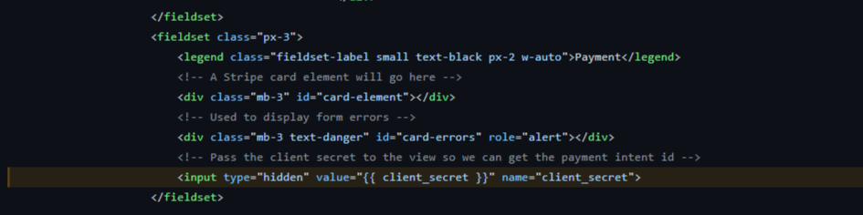

<h1 align="center">Foot Connect</h1>

This is the main website for Foot Connect. A well established online athletic footwear and apparel retailer. Our aim is to bring you the hottest fashion on the market. The site is designed to be responsive and accessible on multiple devices, making it easy to navigate for new and existing visitors.

[visit website here](#)

# User Experience (UX)

| User Story   | As a..   | I want to be able to.. | So that i can.|
| ---------    | -------  |   ------------         | ------------- |
|              |          | <h4 align="center">**Viewing and Navigation** </h4> |               |
|              | Shopper  | Understand the main purpose   of the site. | Decide if i want to stay. | 
|              | Shopper  | View individual product details| Identify the price, description,   product rating, product image, available   sizes and read product reviews |
|              | Shopper  | Quickly identify deals, clearance   items and special offers. | Take advantage of special savings   on products I'd like to purchase.     
|              | Shopper  | Easily view the total of   my purchases at any time. | Avoid spending too much. |
|              |          | <h4 align="center">**Registration and User Accounts** </h4>     |                 |      
|              | Site User  | Easily register for an account | Have a personal account and view my profile. |
|           | Site User | Login or Logout of my account |  Access my personal account information   and any previous order history | 
|         | Site User | Easily recover my password   in case i forget it. | Recover access to my acccount. |
|          | Site User | Receive an email confirmation   after registering. | Verify the my account registration   was successful |
|          | Site User | Have a personalized user profile | View my order confirmation,   history, wishlist, reviews and    view/update personal delivery details |
|          |          | <h4 align="center"> **Sorting and Searching** </h4> |          | 
|          | Shopper    | Sort the list of available products | Easily identify products by category,   name, rating and price |
|          | Shopper | Sort a specific category | Find the best-priced or best-rated product   or price within a category |
|          | Shopper | Add a product to my wishlist | Quickly find a product I've saved,   or purchase again |
|          | Shopper | Search for a product by   name or description | Find a specific product i'd like to purchase. |
|          | Shopper | Easily see what I've searched   for and the results |Decide if the product i'm after is available |
|         |          | <h4 align="center"> **Purchasing and Checkout**</h4> |       |
|         | Shopper | Easily select the size and quantity   of a product when purchasing it. | Can be assured I'm selecting   size and quantity I want |
|         | Shopper | View items in my cart to   be purchased | Identify the total cost of the   items i want to purchase |
|         | Shopper | Change the quantity of items in my cart | Easily make changes before checking out | 
|          | Shopper | see my order confirmation   upon checkout | Verify my order |
|        | Shopper | Receive an email confirmation   upon checkout | I have a personal record of my order |
|         |           | <h4 align="center"> **Admin User Account**</h4>  |       |
|         | Admin User | Add a product | Add new items to my store |
|         |              | Edit/update a product | Change product prices, descriptions,   images and other related fields |
|         |              | Delete a product | Remove items no longer on   offer or out of stock |
 

# DESIGN CHOICES 

-  ## Colour Scheme

Bootstrap variables were chosen to keep the colour scheme of the site clean and consistent.

| variable | Hex |
| -------- | --- |
| --bs-yellow | #ffc107 |
| --bs-gray-700 | #495057 |
| --bs-info | #0dcaf0 |
| --bs-body-color | #0c0e0f |
| --bs-body-bg | #fff |
  

-  ## Typography

-  ### [Google Fonts](https://fonts.google.com/specimen/Squada+One)

    -  ### Squada One font has been choosen to represent for the Foot Connect logo.

-  ## Imagery

-  ### All images on the site were sourced from 
-  ### [Laced](https://www.laced.co.uk/)
-  ### [kaggle](https://www.kaggle.com/)
-  ### [pexels](https://www.pexels.com/)
-  ### [unsplash](https://unsplash.com/)

# TECHNOLOGIES

## LANGUAGES 

-  ### [HTML5](https://en.wikipedia.org/wiki/HTML5)
-  ### [CSS3](https://en.wikipedia.org/wiki/CSS)
-  ### [Javascript](https://en.wikipedia.org/wiki/JavaScript)
-  ### [Python](https://en.wikipedia.org/wiki/Python)

## FRAMEWORKS

-  ### [Bootstrap](https://getbootstrap.com/docs/5.0/getting-started/download/)

-  ### [Django](https://www.djangoproject.com/)

-  ### [JQuery](https://jquery.com/)

## PACKAGES

-  ### [django-allauth](https://django-allauth.readthedocs.io/en/latest/installation.html)

-  ### [django-countries](https://pypi.org/project/django-countries/)
    
-  ### [django-crispy-forms](https://django-crispy-forms.readthedocs.io/en/latest/)

-  ### [pillow](https://pillow.readthedocs.io/en/stable/)
    
-  ### [stripe](https://stripe.com/docs)

## PROJECT MANAGEMENT

-  ### [GitHub](https://github.com/)
   
-  ### [GitPod](https://www.gitpod.io/)

-  ### [Heroku](https://heroku.com/)

-  ### [Git](https://git-scm.com/)

   
##  TOOLS 

-  ### [Google Fonts](https://fonts.google.com/)
   
-  ### [Font Awesome](https://fontawesome.com/) 

-  ### [Balsamiq](https://balsamiq.com/)

-  ### [Am I Responsive](http://ami.responsivedesign.is/)
   
## TESTING

-  ### Bug's found and fixed

CLICK ME

